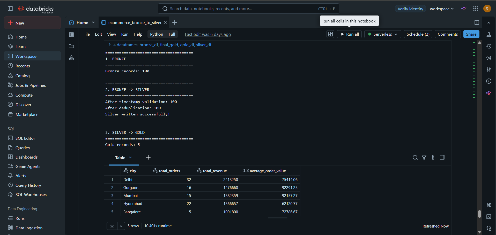
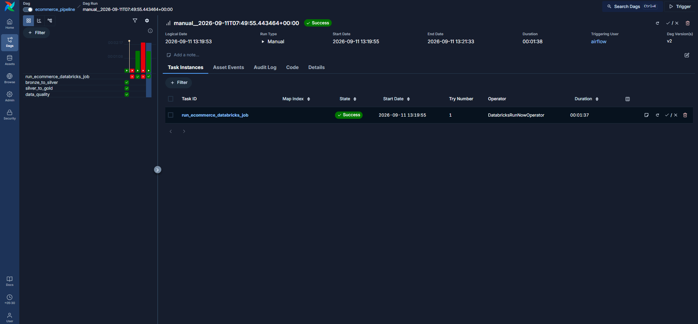
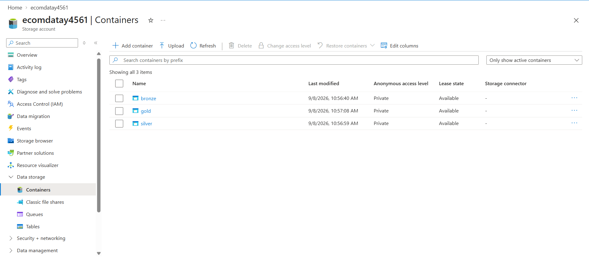
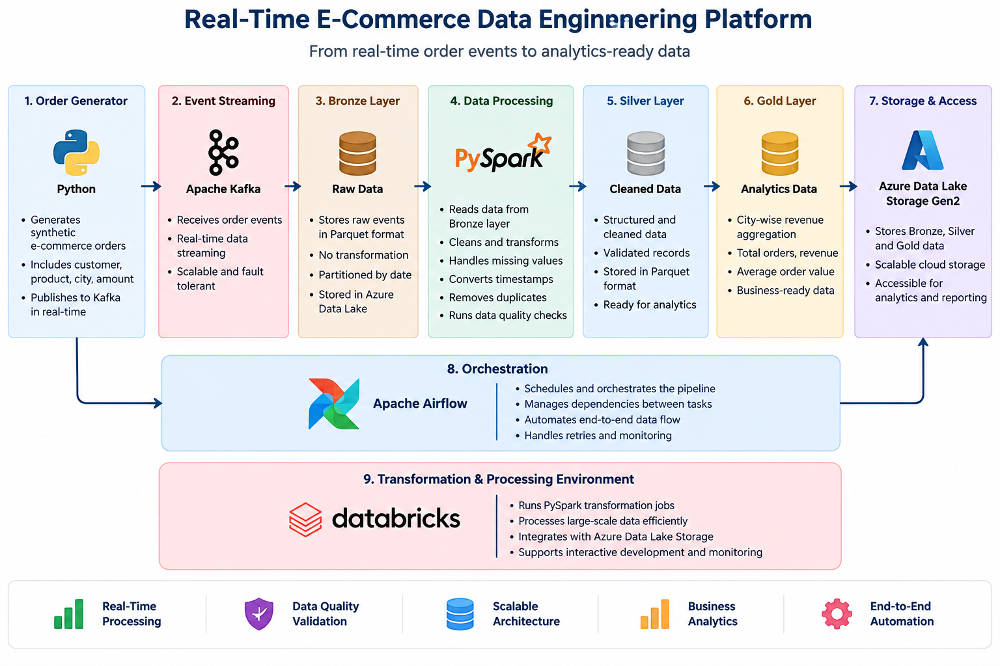

# Real-Time E-Commerce Data Engineering Platform

An end-to-end data engineering project that simulates an e-commerce platform and processes customer order events through a modern data pipeline.

## Project Overview

This project generates synthetic e-commerce order data, streams the events through Apache Kafka, processes them using PySpark, applies data quality checks, and creates analytics-ready datasets using a Bronze–Silver–Gold architecture.

The project also includes Apache Airflow orchestration, Databricks processing, and Azure Data Lake Storage Gen2 for cloud-based data storage.

## Architecture


Python Order Generator
        ↓
Apache Kafka
        ↓
Kafka Consumer
        ↓
Bronze Layer
        ↓
PySpark Transformation
        ↓
Silver Layer
        ↓
Data Quality Checks
        ↓
Gold Layer
        ↓
Databricks + Airflow
        ↓
Azure Data Lake Storage Gen2


## Technologies Used

* Python
* Apache Kafka
* Apache Spark / PySpark
* Apache Airflow
* Databricks
* Azure Data Lake Storage Gen2
* SQL
* Parquet
* JSON
* Docker
* Git and GitHub

## Key Features

* Generates synthetic customer and order events.
* Streams order data through Apache Kafka.
* Stores raw order events in the Bronze layer.
* Converts and cleans timestamps using PySpark.
* Removes duplicate orders using `order_id`.
* Performs data validation and quality checks.
* Creates Silver-level cleaned order data.
* Aggregates revenue by city in the Gold layer.
* Calculates total orders, total revenue, and average order value.
* Orchestrates Databricks processing through Apache Airflow.
* Stores cloud copies of Bronze, Silver, and Gold datasets in Azure Data Lake Storage Gen2.

## Data Layers

### Bronze Layer

Contains raw order events received from Kafka.

Example fields:

* `order_id`
* `customer_id`
* `product_id`
* `amount`
* `city`
* `payment_method`
* `timestamp`

### Silver Layer

Contains cleaned and transformed order data.

Transformations include:

* Timestamp conversion
* Invalid timestamp filtering
* Duplicate order removal
* Data type standardization

### Gold Layer

Contains business-ready city-level revenue analytics.

Metrics include:

* Total orders
* Total revenue
* Average order value

## Data Quality Checks

The project validates:

* Missing order IDs
* Missing customer IDs
* Missing city values
* Missing payment methods
* Missing timestamps
* Invalid order amounts
* Duplicate order IDs

## Airflow Orchestration

Apache Airflow is used to trigger the Databricks transformation job.

The pipeline includes a task that executes the Databricks notebook responsible for:

1. Reading Bronze data
2. Transforming data into Silver
3. Creating Gold-level city revenue analytics
4. Saving the final Gold table

## Cloud Storage

Azure Data Lake Storage Gen2 is used to store cloud copies of the processed datasets.

```text
bronze/
silver/orders/orders.parquet
gold/city_revenue/city_revenue.json
```

## Project Structure

```text
real-time-ecommerce-data-engineering/
│
├── airflow/
│   ├── dags/
│   ├── config/
│   ├── docker-compose.yaml
│   └── requirements.txt
│
├── kafka/
│
├── project/
│   ├── order_generator.py
│   ├── kafka_python_consumer.py
│   ├── kafka_spark_consumer.py
│   ├── bronze_to_silver.py
│   ├── silver_to_gold.py
│   ├── data_quality.py
│   ├── read_bronze.py
│   ├── read_silver.py
│   └── spark_test.py
│
├── .gitignore
└── README.md
```

## Project Outcome

The pipeline successfully processed synthetic e-commerce order data and generated:

* 100 order records
* Cleaned Silver order data
* City-level Gold revenue summaries
* Data quality validation results
* An Airflow-triggered Databricks transformation workflow

## Future Improvements

* Implement continuous Spark Structured Streaming.
* Automate Azure uploads using Azure SDK or AzCopy.
* Add a dashboard using Power BI or Streamlit.
* Add automated testing through GitHub Actions.
* Add incremental processing and partitioning.
* Add monitoring and alerting for pipeline failures.

## Project Screenshots

### Databricks Pipeline


### Airflow DAG


### Azure Storage


### Azure Silver and Gold Data


### System Architecture

